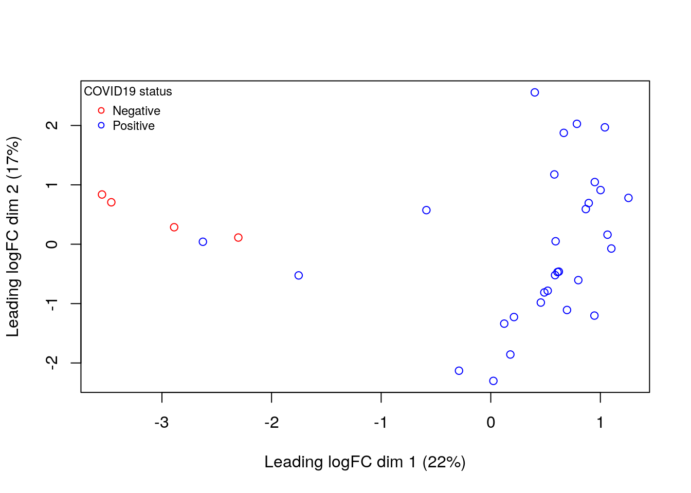
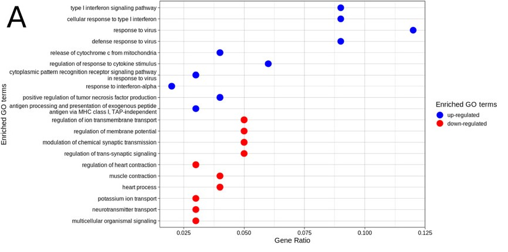

```{r setup, include=FALSE}
# will not be shown in the knitted html file

# installing and loading required packages
library(knitr)
library(edgeR)
library(circlize)
library(ggplot2)
library(ComplexHeatmap)
library(gprofiler2)

# ensuring all code, unless otherwise stated, appears in the RMarkdown document, but no warnings do
opts_chunk$set(echo = TRUE)
opts_chunk$set(warnings = FALSE)
```

# Introduction

[Singh et. al](https://doi.org/10.1002/ctm2.534)[@singh2021] sought to investigate the transcriptional changes which occur during COVID-19 infection by performing bulk RNA-seq and differential gene expression analysis on transcripts isolated from nasopharyngeal and oropharyngeal swabs of COVID-19 positive and COVID-19 negative individuals. The bulk RNA-seq data was generated by paired-end sequencing with the Illumina Nova-seq 6000 device. From the [GEO accession (GSE166530)](https://www.ncbi.nlm.nih.gov/geo/query/acc.cgi?acc=GSE166530) associated with this paper, I extracted a raw counts matrix generated by NCBI using the data collected by Singh et al. In Assignment 1, I began to analyze the raw count data associated with four COVID-19 negative individuals and thirty COVID-19 positive individuals. This dataset contained counts for 39,376 genes.

In filtering this data, I removed genes expressed in <4 samples, which reduced noise in the number of raw counts per gene, especially at low count levels, and tightened the distribution of count density across genes. After this step, 16,947 genes remained for further analysis. I then normalized the raw counts using edgeR[@edger] and the `cpm()` function, which further reduced the spread in density of transcript levels across genes. A multidimensional scaling plot[@limma] revealed transcriptomic data sourced from COVID-19 negative samples clustered away from that sourced from COVID-19 positive samples[@juba_a1].


Figure 1. Multidimensional scaling plot generated with limma using normalized bulk RNA-seq transcriptomic data originating from nasopharyngeal and oropharyngeal samples of COVID-19 positive and COVID-19 negative individuals. From Jade Juba, Assignment 1.

After mapping NCBI-associated Entrez Gene IDs to HGNC symbols, removing duplicate genes, and removing genes which could not be mapped, 15,122 genes remained for further analysis.

This assignment contains differential gene expression analysis and preliminary thresholded over-representation analysis on the Singh et al. dataset.

Questions about differential gene expression and thresholded over-representation analysis are answered in their respective sub-sections in the **Analysis** section. Questions about data interpretation are answered in the **Discussion** section.

# Analysis

## Differential gene expression

I read the table of normalized and filtered counts from Assignment 1 into a matrix. In the process of formatting this data, it came to my attention through an error thrown by R that some HGNC gene symbols appeared more than once in the table. To fix this, I added a line of code to remove rows with duplicate HGNC symbols. This step left 15,122 genes for further analysis.

I also read the table of samples into a data frame. This table contains a column denoting whether the sample originated from a COVID-19 positive or COVID-19 negative patient, and is eventually used to define our groups.

```{r Reading in Assignment 1 data}
filt_norm_df <- data.frame(read.csv("filt_norm_counts.csv")) # filtered, normalized, cleaned data from Assignment 1
filt_norm_df <- filt_norm_df[!duplicated(filt_norm_df$hgnc_symbol),] # removing rows with duplicate HGNC symbols
rownames(filt_norm_df) <- filt_norm_df[, 2] # setting the HGNC gene symbols as the row name
filt_norm_df <- filt_norm_df[, -1:-2] # removing the Ensembl ID and HGNC symbol columns
filt_norm_matrix <- as.matrix(filt_norm_df) # transforming the data into a matrix

samples <- data.frame(read.csv("samples.csv")) # samples and sample type (COVID-19 positive or negative)
samples <- samples[, -1] # removing column of incrementing whole numbers
```

I then created the model design and printed a preview. The column name `samples$COVID19_StatusPositive` is used as the coefficient name for the QLF test in the following chunk.

```{r Creating model design}
model_design <- model.matrix(~samples$COVID19_Status) # creating model design using condition of COVID19 positive or negative
model_design[1:10,]
```
Table 1. Model design for analyzing differential expression of bulk RNA-seq data from patients. Patients are either COVID-19 negative (corresponding to '0' in the binary code of this model) or COVID-19 positive (corresponding to '1').


I then created the EdgeR[@edger] differential expression model, estimated dispersion in the model to account for noise between biological replicates and provide a measure of confidence in the data, fit the model to the data, and calculated differential expression with a quasi-likelihood (QL) method. This method can provide more reliable results for small sample sizes (such as the sample size of 4 for COVID-19 negative individuals), as the method incorporates uncertainty in its estimates of dispersion, decreasing the risk for false positives.

```{r EdgeR model, message=FALSE}
d = DGEList(counts = filt_norm_matrix, group = samples$COVID19_Status) # grouping data by COVID19 status
d <- estimateDisp(d, model_design) # estimating dispersion in our model
fit <- glmQLFit(d, model_design) # fitting the model
qlf.positive_vs_negative <- glmQLFTest(fit, coef = "samples$COVID19_StatusPositive") # calculating differential expression using a quasi-likelihood method
```

Below is the first 10 rows from a Table of the Top Differentially Expressed Genes/Tags (TopTags) of the output from the EdgeR differential expression analysis, sorted by increasing P-value. This means the model was most certain that these genes were differentially-expressed between COVID-19 positive and COVID-19 negative samples. It does not mean that these genes had the greatest magnitude of change in relative expression between COVID-19 positive and COVID-19 negative samples; the magnitude of this differential expression is represented by the log fold change (logFC), in which a negative logFC denotes genes that were downregulated in COVID-19 positive samples, and a positive logFC denotes genes that were upregulated in COVID-19 positive samples.

```{r TopTags, echo=FALSE}
qlf_output_hits <- topTags(qlf.positive_vs_negative, sort.by = "PValue", n = nrow(filt_norm_matrix)) # creating a TopTags object with our differential expression data
head(qlf_output_hits, 10)
```
Table 2. TopTags results displaying genes that are differentially-expressed between conditions (COVID-19 positive vs. COVID-19 negative) in the Singh et al. dataset with a significance level of `p < 0.05`. The 10 genes with the smallest p-values are shown here. logFC is the fold change in expression values between conditions. logCPM is the average expression level of a gene across samples. F represents the strength of differential expression between conditions relative to random variability. PValue is the raw p-value, or the probability of observing the calculated differential expression data for the gene by chance. FDR is the adjusted p-value after correction for multiple comparisons with the Benjamini-Hochberg method. Differential expression was calculated using EdgeR[@edger].

```{r P-value threshold}
# checking how many genes have a raw p-value less than the threshold of 0.05
length(which(qlf_output_hits$table$PValue < 0.05))
```

6841 out of 15122 genes (45.24%) have a raw p-value less than the threshold of 0.05. This value is rather high, but we will not increase the stringency of our analysis by decreasing the p-value threshold. This threshold is conventional and balances the risk of false positives and false negatives, and the risk is further decreased as we calculate adjusted p-values and continue the analysis with those values. Additionally, as will be seen later, the number of genes downregulated in COVID-19 positive samples makes up >99.5% of all differentially-expressed genes in this dataset; the number of genes upregulated in COVID-19 positive samples is only 17, and decreasing the p-value would further decrease this value, whichis already very small.

```{r FDR correction}
# checking how many genes pass correction for multiple comparisons using the false discovery rate (FDR) method
length(which(qlf_output_hits$table$FDR < 0.05))
```

5282 out of 6841 genes (77.21%) pass correction for multiple comparisons using the  Benjamini-Hochberg (BH) method of adjusting p-values. The BH method was used because it is less strict than other methods, such as the Bonferroni method, which may cut truly differentially-expressed genes from our analysis due to its stringency. BH provides a more balanced approach to detecting true positives while avoiding false positives.

The analysis proceeds using these 5282 genes (using adjusted p-value instead of raw p-value).

Below is a volcano plot, generated with ggplot2[@ggplot2], displaying all genes which underwent differential expression analysis. Genes deemed significant have an adjusted p-value of less than 0.05 and an absolute logFC of greater than 1. 4-5 genes of interest were chosen for each group of differentially expressed genes (those which are downregulated in COVID-19 positive samples, and those which are upregulated in these samples); the parameters which define these genes were arbitrarily chosen so that there were 4-5 genes per group, therefore the parameters differ for each group, as there are many more downregulated genes with a wider spread and more extreme logFC and p-values compared to upregulated genes. These parameters are described in the figure caption.

```{r Volcano plot, fig.cap = "Figure 2. Volcano plot of differential expression analysis on genes detected in nasopharyngeal or oropharyngeal swab samples samples from COVID-19 negative and positive patients. Significant genes have p < 0.05 and logFC > 1. Genes of interest that are downregulated in COVID-19 positive patients (logFC < 0) have corrected p-value < 5 * 10^-11 and logFC < 3. Genes of interest that are upregulated in COVID-19 positive patients (logFC > 0) have corrected p-value < 0.05 and logFC > 3."}
# creating a table for data to use in the volcano plot
volcano_table <- qlf_output_hits$table
volcano_table$Gene <- rownames(volcano_table)

# adding a column for significance, with thresholds for p-value and logFC value, and denoting which genes are of interest
volcano_table$Significance <- ifelse(volcano_table$FDR < 0.05 & abs(volcano_table$logFC) > 1, "Significant", "Not Significant")
volcano_table$Significance <- ifelse(volcano_table$FDR < (5*10^-11) & volcano_table$logFC < 3, "Of interest", volcano_table$Significance)
volcano_table$Significance <- ifelse(volcano_table$FDR < 0.05 & volcano_table$logFC > 3, "Of interest", volcano_table$Significance)

# creating volcano plot
ggplot(volcano_table, aes(x = logFC, y = -log10(FDR), color = Significance)) +
  geom_point(alpha = 0.7) + 
  scale_color_manual(values = c("Not significant" = "gray", "Significant" = "red", "Of interest" = "blue")) + 
  theme_minimal() + 
  labs(x = "log2 fold change", y = "-log10 adjusted p-value") + 
  geom_hline(yintercept = -log10(0.05), linetype = "dashed", color = "black") +
  geom_vline(xintercept = c(-1, 1), linetype = "dashed", color = "black") # between logFC thresholds
```

```{r Downregulated genes of interest}
# printing genes of interest that are downregulated in COVID-19 positive samples
rownames(volcano_table)[which(volcano_table$FDR < (5*10^-11) & volcano_table$logFC < 3)]
```
CRYAB, INPP5A, TMEM179, and GPRIN2 are the genes of interest that are downregulated in COVID-19 positive samples.

```{r Upregulated genes of interest}
# printing genes of interest that are upregulated in COVID-19 positive samples
rownames(volcano_table)[which(volcano_table$FDR < 0.05 & volcano_table$logFC > 3)]
```
SMPRD3D, SNORA48, SNORA54, SNORD94, and RPS29 are the genes of interest that are upregulated in COVID-19 positive samples. The first four are small nucleolar RNAs, and the last is the S29 ribosomal protein.


Below is a heatmap representation, generated with circlize[@circlize] and ComplexHeatmap[@heatmap], of the differential expression data for genes associated with an adjusted p-value of <0.05. It can be seen that 3/4 COVID-19 negative samples cluster together, and 27/30 COVID-19 positive samples cluster in one large group. However, one COVID-19 negative sample clusters with three other COVID-19 positive samples, and these four samples cluster entirely away from the other 26. This could represent other conditions that our analysis is blind to as we only consider the status of COVID-19 infection at the time of sampling. Other possible confounding effects include age, sex, and other conditions of disease or illness.

```{r Heatmap, fig.cap = "Figure 3. Heatmap of differential expression data in the Singh et al. dataset. Each row represents one of 5282 genes associated with an adjusted p-value of <0.05. Each column represents a sample from a unique patient, four of which were COVID-19 negative and thirty of which were COVID-19 positive at the time of sampling."}
ht_opt$message = FALSE # prevents message about heatmap parameters from printing

top_hits <- rownames(qlf_output_hits$table)[qlf_output_hits$table$FDR < 0.05] # genes which were differentially-expressed with significance of FDR < 0.05
top_hits_heatmap_matrix <- t(scale(t(filt_norm_matrix[which(rownames(filt_norm_matrix) %in% top_hits), ]))) # creating a matrix for the top hits

if(min(top_hits_heatmap_matrix) == 0){
  heatmap_col = colorRamp2(c(0, max(top_hits_heatmap_matrix)), c("white", "red")) # if differential expression values don't go below 0, don't use the colour blue (which is for negative values in our heatmap)
  
  } else {
    heatmap_col = colorRamp2(c(min(top_hits_heatmap_matrix), 0, max(top_hits_heatmap_matrix)),
                             c("blue", "white", "red")) # if differential expression values go below zero, use blue in the heatmap
  }

# defining parameters for visual representations of our groups (COVID-19 positive and negative)
unique_COVID19_status <- unique(samples$COVID19_Status)
unique_COVID19_status_colours <- c("grey", "red")
names(unique_COVID19_status_colours) <- unique_COVID19_status

# creating a heatmap annotation for our groups
ha_patients <- HeatmapAnnotation(df = data.frame(COVID19_status = samples$COVID19_Status), col = list(COVID19_status = unique_COVID19_status_colours), show_legend = TRUE)

# creating the heatmap
current_heatmap <- Heatmap(as.matrix(top_hits_heatmap_matrix), top_annotation = ha_patients, cluster_rows = TRUE, cluster_columns = TRUE, show_row_dend = TRUE, show_column_dend = TRUE, col = heatmap_col, show_column_names = FALSE, show_row_names = FALSE, show_heatmap_legend = TRUE, heatmap_legend_param = list(title = "Normalized\nexpression\nlevel"))
current_heatmap
```

## Thresholded over-representation analysis

It is clear by the volcano plot (Figure 1) that the bulk of differentially-expressed genes are down-regulated in COVID-19 positive samples, with only a few being upregulated in COVID-19 positive samples.

```{r Upregulaged genes}
# retrieving the number of genes that are upregulated in COVID-19 positive samples
length(which(qlf_output_hits$table$FDR < 0.05 & qlf_output_hits$table$logFC > 0))
```
Only 17 out of 5282 genes with an adjusted p-value of <0.05 were upregulated in COVID-19 positive samples. Recall that one of the reasons the p-value threshold for signficance was not decreased was because there were so few genes deemed significantly upregulated in COVID-19 positive samples under the current threshold.

```{r Downregulated genes}
length(which(qlf_output_hits$table$FDR < 0.05 & qlf_output_hits$table$logFC < 0))
```

5265 genes were downregulated in COVID-19 positive samples.

I then created thresholded lists of upregulated and downregulated genes, on which to perform overrepresentation analysis (ORA). Alhtough the small number of upregulated genes for the COVID-19 positive condition may benefit from a non-thresholded list, thresholded lists are simpler and take genes with significance above an arbitrary threshold (here, of adjusted p-value of <0.05), which is how the dataset has been handled during the analysis thus far. Additionally, there are a large amount of genes which are downregulated in COVID-19 positive samples, meaning a thresholded list should lead to an efficient analysis.

```{r Thresholded lists}
# creating a new table for qlf_output_hits with gene names as its own column
qlf_output_hits_names <- merge(rownames(qlf_output_hits), qlf_output_hits, by.x = 1, by.y = 0)
colnames(qlf_output_hits_names)[which(names(qlf_output_hits_names) == "x")] <- "HGNC"

# creating vectors for HGNC symbols of upregulated and downregulated genes with an adjusted p-valie of <0.05
upregulated_genes <- qlf_output_hits_names$HGNC[which(qlf_output_hits_names$FDR < 0.05 & qlf_output_hits_names$logFC > 0)]
downregulated_genes <- qlf_output_hits_names$HGNC[which(qlf_output_hits_names$FDR < 0.05 & qlf_output_hits_names$logFC < 0)]

# writing the HGNC symbols to tables and saving them
write.table(x = upregulated_genes, file = file.path(getwd(),"ovrecurrent_upregulated_genes.txt"), sep = "\t", row.names = FALSE, col.names = FALSE, quote = FALSE)
write.table(x = downregulated_genes, file = file.path(getwd(), "ovrecurrent_downregulated_genes.txt"), sep = "\t",row.names = FALSE, col.names = FALSE,quote = FALSE)
```

I performed ORA with g:Profiler[@gprofiler], which accesses a wide range of gene sets to provide information and is updated regularly with the newest data.

```{r gProfiler version}
packageVersion("gprofiler2")
```

This analysis uses g:Profiler version 0.2.3.

I first perform a g:Profiler ORA on the combined set of upregulated and downregulated genes.

```{r gProfiler on all genes}
up_and_down_genes <- c(upregulated_genes, downregulated_genes) # combining lists of upregulated and downregulated genes
up_and_down_gpro <- gost(query = up_and_down_genes, organism = "hsapiens", multi_query = TRUE) #running g:Profiler on up_and_down_genes
nrow(up_and_down_gpro$result) # returning number of genesets
```

g:Profiler returned 1489 genesets.

```{r gProfiler - all genes - significant genesets}
nrow(up_and_down_gpro$result[up_and_down_gpro$result$p_values < 0.05,]) # returning number of genesets with p-value < 0.05
```

All of the returned genesets have a p-value of < 0.05.

```{r gProfiler - all genes - top terms}
# displaying top GO term names
up_and_down_results <- up_and_down_gpro$result
head(up_and_down_results$term_name, 10)
```
Table 3. Top 10 term names associated with the genesets returned for the combined set of upregulated and downregulated genes. All of these are related to transcription.

I repeated the analysis for upregulated genes and downregulated genes separately.

```{r gProfiler - up genes - genesets}
# analysis on upregulated genes
up_gpro <- gost(query = upregulated_genes, organism = "hsapiens")
nrow(up_gpro$result)
nrow(up_gpro$result[up_gpro$result$p_value < 0.05, ])
```

For upregulated genes, g:Profiler returned 8 genesets, all of which met the threshold of p < 0.05.

```{r gProfiler - up genes - top terms}
# top GO terms of upregulated genes
up_results <- up_gpro$result
up_results$term_name
```
Table 4. Term names associated with the genesets returned for upregulated genes.

The genesets of upregulated genes are all related to RNA splicing.

```{r gProfiler - down genes - genesets}
# analysis on downregulated genes
down_gpro <- gost(query = downregulated_genes, organism = "hsapiens")
nrow(down_gpro$result)
nrow(down_gpro$result[down_gpro$result$p_value < 0.05,])
```

For downregulated genes, g:Profiler returned 1500 genesets, all of which met the threshold of p < 0.05.

```{r}
# top GO terms on downregulated genes
down_results <- down_gpro$result
head(down_results$term_name, 20)
```

The genesets of upregulated genes tend to be related to signalling, transport between cells, and development of organisms and cells.

When both sets of genes are run together, the number of returned genesets is much larger, even though the combined number of genes is not much more than the number of downregulated genes. Also, the geneset term names are more specific, related to specific transcription factors and motifs, whereas when upregulated and downregulated genesets are separated, the top terms are broader and related to general cellular/organismal activities and pathways.

# Interpretation

Our differential gene expression analysis using EdgeR[@edger] identified 5282 genes which were differentially-expressed between COVID-19 positive and COVID-19 negative samples collected by Singh et al.[@singh2021]. 17 of these genes were upregulated in COVID-19 positive samples, and 5265 were downregulated. Over-representation analysis using g:Profiler[@gprofiler] showed that genes involved in RNA processing tend to be upregulated in COVID-19 positive samples, whereas genes involved in signalling, cell transport, and development tend to be downregulated in COVID-19 negative samples.

The analysis performed by Singh et al.[@singh2021] identified 251 genes that were upregulated in COVID-19 positive samples, and 9068 which were downregulated. Although we identified less genes in both sets, the difference between our 17 upregulated genes and their 251 upregulated genes is stark. One factor behind this difference is likely the fact that our dataset is missing one COVID-19 negative sample and six COVID-19 positive samples, as these samples were not represented in the NCBI-generated raw counts matrix from which we retrieved our data. These missing samples may have provided more information and led to a greater amount of differentially-expressed genes identified. Another likely factor is a difference in analysis packages and techniques, although both Singh et al. and our analysis used a p-value threshold of <0.05 and a logFC threshold of >1. 
The ORA performed by Singh et al. identified most upregulated genes as participating in immune signalling pathways; however, in our analysis, all upregulated genes were related to RNA splicing, and many of the upregulated genes were small nucleolar RNAs. This should partially reflects the small number of upregulated genes identified in our analysis compared to Singh et al., however, it is still surprising that none of the top GO terms between our upregulated gene datasets match.

Several of the top GO terms of genes downregulated in COVID-19 positive samples in Singh et al.'s analysis are related to cell transport and signalling. We identified the same or similar GO terms in our ORA of downregulated genes; however, Singh et al. identified GO terms related to both heart and neuronal functions in addition to more general terms, whereas our analysis only identified terms related to general and neuronal functions without mention of heart functions in the top 10 GO terms.



In broad terms, Singh et al. outline some possible mechanisms by which the gene sets they identified as downregulated in COVID-19 positive samples may mediate symptoms and effects of COVID-19. Some of the signalling pathways they identified are required for contraction of cardiac muscles and secretion of hormones, such as insulin,  from the pancreas. It is known that COVID-19 can affect the heart[@chung2021] and can lead to increased need for insulin in diabetic patients[@wu2020]. The transport- and signalling-related GO terms identified in our ORA may be similarly related to effects of COVID-19 on the body.

In other papers, there is evidence of that COVID-19 affects the processes identified by the ORA in both our upregulated and downregulated sets of genes. COVID-19 is known to affect the nervous system and the brain, causing structural changes, damaging neurons, and producing neurologic symptoms and conditions in patients[@spudich2022]; this may represent a mechanism by which genes related to neurogenesis and neuronal signalling are downregulated in COVID-19 positive samples. Additionally, alternative splicing has been found to occur in COVID-19 positive samples, with one paper describing a mechanism by which alternative splicing of immune proteins in COVID-19 positive cells causes loss-of-function of those proteins, promoting COVID-19 infection throughout the body[@dias2024]. Taking our findings into account, the upregulation of genes related to splicing may facilitate this.