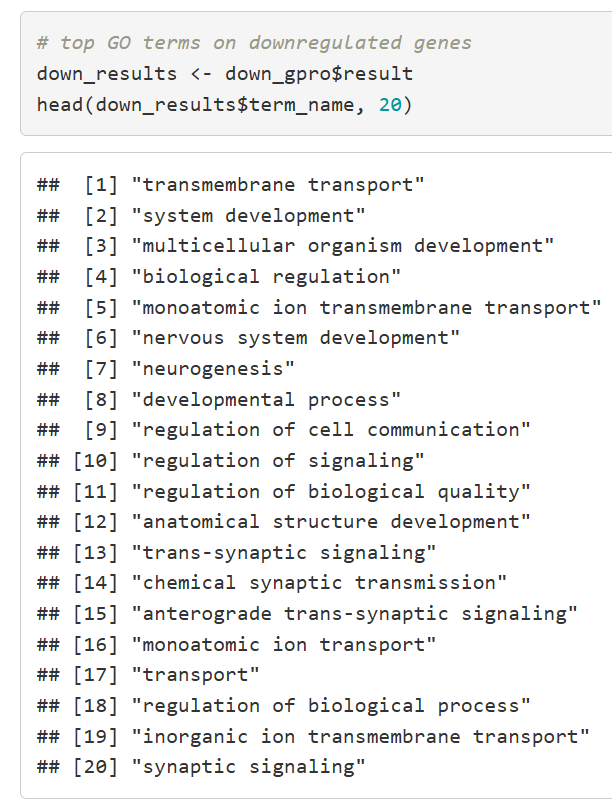

```{r setup, include=FALSE}
# will not be shown in the knitted html file

# installing and loading required packages
library(knitr)

# ensuring all code, unless otherwise stated, appears in the RMarkdown document, but no warnings do
opts_chunk$set(echo = TRUE)
opts_chunk$set(warnings = FALSE)
```

# Introduction

[Singh et. al](https://doi.org/10.1002/ctm2.534)[@singh2021] investigated the transcriptional changes which occur during COVID-19 infection by performing bulk RNA-seq and differential gene expression analysis on transcripts isolated from nasopharyngeal and oropharyngeal swabs of COVID-19 positive and COVID-19 negative individuals. Their bulk RNA-seq data was generated by paired-end sequencing with the Illumina Nova-seq 6000 device. From the [GEO accession (GSE166530)](https://www.ncbi.nlm.nih.gov/geo/query/acc.cgi?acc=GSE166530) associated with this paper, I extracted a raw counts matrix generated by NCBI using the data collected by Singh et al.

In Assignment 1, I began to analyze the raw count data associated with four COVID-19 negative individuals and thirty COVID-19 positive individuals. This dataset contained counts for 39,376 genes. In filtering this data, I removed lowly-expressed genes to reduce noise in the number of raw counts per gene and tighten the distribution of count density across genes. This left 16,947 genes for further analysis. I then normalized the raw counts using edgeR[@edger] and `cpm()`. A multidimensional scaling plot[@limma] revealed transcriptomic data sourced from COVID-19 negative samples clustered away from that sourced from COVID-19 positive samples. After mapping to HGNC symbols and removing unmappable or duplicate genes, 15,122 genes remained for further analysis.[@juba_a1]

In Assignment 2, I performed differential gene expression analysis using EdgeR[@edger] and the Quasi-likelihood method. 5,282 out of 15,122 genes (34.9%) passed Benjamini-Hochberg (BH) correction for multiple comparisons. Only 17 of these 5282 genes were upregulated in COVID-19 positive samples, and 5265  were downregulated in COVID-19 positive samples.[@juba_a2, @ggplot2]

---

![Figure 1. Volcano plot of differential expression analysis on genes detected in nasopharyngeal or oropharyngeal swab samples samples from COVID-19 negative and positive patients. Significant genes have p < 0.05 and logFC > 1. Genes of interest that are downregulated in COVID-19 positive patients (logFC < 0) have corrected p-value < 5 * 10^-11 and logFC < 3. Genes of interest that are upregulated in COVID-19 positive patients (logFC > 0) have corrected p-value < 0.05 and logFC > 3. From Assignment 2.](figures/a2_volcanoplot.png)

---

Thresholded over-representation analysis was performed using g:Profiler[@gprofiler]. Genes upregulated in COVID-19 positive samples were found to be enriched in gene sets related to RNA processing and splicing. Genes downregulated in COVID-19 positive samples were found to be enriched in gene sets related to cell transport and communication, system development, and neurosignalling.

In this assignment, I will perform non-thresholded gene set enrichment analysis[@gsea] on the differential expression data generated in Assignment 2. I will create a visual representation of this data using Cytoscape[@cytoscape] and perform a post-analysis using drugs which may be able to ameliorate COVID-19 systems. The results of this GSEA will be compared to the ORA from Assignment 2 and to the analysis presented in the original paper by Singh et al.[@singh2021]

# Non-thresholded gene set enrichment analysis (GSEA)

I read our table of differential expression data from Assignment 2 into a data frame, then calculated the rank of each gene's level of differential expression using p-value and fold change. Genes were ordered by their rank to create a non-thresholded list of differentially expressed genes.

```{r Non-thresholded list}
# Creating a non-thresholded list of genes
qlf_output_hits <- data.frame(read.csv("qlf_output_hits_names.csv")) # loading in differential expression data from Assignment 2

qlf_output_hits[, "rank"] <- -log(qlf_output_hits$PValue, base = 10) * sign(qlf_output_hits$logFC) # creating rank column with values of -log10 p-value multiplied by fold change
qlf_output_hits <- qlf_output_hits[order(qlf_output_hits$rank),] # ordering table based on rank
qlf_output_hits <- qlf_output_hits[qlf_output_hits$HGNC != "", ] # removing genes that don't have gene symbols
write.table(x = data.frame(genename = qlf_output_hits$HGNC, F_stat = qlf_output_hits$rank), file = file.path(getwd(),"covid_status_ranked_genelist.txt"), sep = "\t", row.names = FALSE, col.names = FALSE, quote = FALSE) # writing non-thresholded list to a file
qlf_output_hits[1:5, c("HGNC", "rank")]
```
Table 1. The first five rows of the sorted non-thresholded list of genes that are differentially expressed in COVID-19 positive and negative samples.

---

I downloaded GSEA[@gsea] v. 4.4.0 and performed the analysis within the software. I also downloaded the most up-to-date (March 1st, 2025) and extensive human gene ontology biological process gene set database from the Bader Lab, [Human_GOBP_AllPathways_noPFOCR_no_GO_iea_March_01_2025_symbol.gmt](https://download.baderlab.org/EM_Genesets/March_01_2025/Human/symbol/Human_GOBP_AllPathways_noPFOCR_no_GO_iea_March_01_2025_symbol.gmt)[@bader]. This dataset does not include inferred electronic analysis, as experimental results provide a stronger basis for linking genes to biolgoical pathways, nor does it include pathway information extracted from published figures to limit the dataset.

In the GSEA software, I selected the tool `Run GSEAPreranked`. I inputted the aforementioned gene set database and the non-thresholded ranked list of differentially expressed genes. I set the number of permutations to 1000. There are a large number of differentially expressed genes in this dataset (5265 genes were downregulated in COVID-19 positive samples with an FDR < 0.05, but only 17 were upregulated), and over-representation analysis with a thresholded list produced 1489 genesets across all genes differentially expressed between COVID-19 illness conditions; therefore, I set the minimum size of genesets to 15 and the maximum size to 500 so the genesets which are returned are neither too numerous and specific or too large and vague.

---


---

15121 genes were analyzed and 6083 gene sets of 15-500 genes were returned. Of the 6083 gene sets, 263 were upregulated in COVID-19 positive samples (159 significant at FDR < 25%, 37 significantly enriched at nominal p-value < 1%) and 5820 were downregulated in COVID-19 positive samples (312 significantly enriched at FDR < 25%, 318 significantly enriched at nominal p-value < 1%).

---


---


---

In Assignment 2[@juba_a2], over-representation analysis with g:Profiler[@gprofiler] returned 8 gene sets which were significantly upregulated in COVID-19 positive samples, and 1500 which were significantly downregulated COVID-19 positive samples. Interestingly, ORA returned less upregulated gene sets but more downregulated gene sets than GSEA.

---


---



---

ORA identified gene sets related to RNA processing as being upregulated in COVID-19 positive samples, whereas GSEA identified a variety of gene sets, many of them related to immune response. The difference between the two is striking. Interestingly, the GSEA results align more closely with the analysis performed by Singh et al. using this dataset (which they gathered), in which they found the most upregulated gene sets to be related to an immune response[@singh2021] (see figure below). Interferon signalling pathways and MHC-related gene sets are explicitly shared between the results of this GSEA and the gene sets identified in their paper. The GSEA results are supported by the general mechanism of the human body's response to viral infection, in which an immune response is mounted to fight off that infection. Interferon response has been shown to be important during the immune response to COVID-19[@samuel2022].

---


---

The gene sets identified as downregulated in COVID-19 positive samples are similar between ORA and GSEA. Both are highly enriched in pathways involving signalling, particularly neurosignalling; however, ORA returned broader gene sets related to development and regulation. This discrepancy is likely because the limits placed on gene set size were not as strict in ORA. This is unlikely to be why the upregulated gene sets returned for the two methods of analyses were so different, as ORA did not return very general gene sets for upregulated genes as it did for downregulated genes. The comparison here is very straightforward, whereas for upregulated genes, there is no obvious congruency between the outputs of the two different analyses.

# Visualizing GSEA in Cytoscape

I downloaded Cytoscape[@cytoscape] v. 3.10.3 and used the software to visualize the results of the GSEA. I used EnrichmentMap[@enrichmentmap] to create an enrichment map, inputting files generated by the GSEA software (gsea_report_for_na_neg, gsea_report_for_na_pos) as well as the gene set database used ([Human_GOBP_AllPathways_noPFOCR_no_GO_iea_March_01_2025_symbol.gmt](https://download.baderlab.org/EM_Genesets/March_01_2025/Human/symbol/Human_GOBP_AllPathways_noPFOCR_no_GO_iea_March_01_2025_symbol.gmt))[@bader] and the non-thresholded ranked list of differentially expressed genes generated through R. I used an FDR q-value cut-off of 0.05 and left the density of edges as default, between sparse and dense. I did not input any files for expression or classes, as these are not required for the analysis, and given the small amount of gene sets determined to be upregulated in COVID-19 positive samples, I did not want to further limit the data.

---


---

The resulting enrichment map had 137 nodes and 1395 edges.

---


---

I downloaded AutoAnnotate[@autoannotate] to annotate the network. I kept the amount of clusters at the default setting, at the midline between the two extremes of fewer and more. I chose not to create singleton clusters as I only wanted to visualize large and more meaningful clusters based on an abundance of data. I did not choose to minimize overlap between clusters, as overlap could reflect meaningful relationships between pathways. I labelled each cluster with the gene set description.

---


---

After annotating the clusters, I filtered the clusters so that only those with more than two gene sets within them would remain on the visual map. The outline of some annotations remained even after the nodes in these clusters disappeared, so I manually deleted those annotation outlines.

---


---

I also changed the style settings so gene sets which are downregulated in COVID-19 positive samples are coloured blue, and gene sets which are upregulated in these samples are coloured red.

---


---

This figure reflects the results briefly described for the GSEA analysis. Genes downregulated in COVID-19 positive samples are enriched for signalling pathways, particularly those related to the nervous system. Genes upregulated in COVID-19 positive samples are related to protein and glycoprotein assembly. There is overlap between the different clusters identifed amongst downregulated genes, which is expected due to the similarity of the gene sets and their relation to neuronal pathways. The downregulated and upregulated gene sets group away from each other and do not overlap, providing further evidence for a transcriptomic divide between COVID-19 positive and negative naso/oropharyngeal samples.

---


---

# Interpretation

As touched upon earlier, the GSEA match the analysis in the original paper more closely than the ORA results do. GSEA found 263 genes upregulated in COVID-19 positive samples and 5820 downregulated, where as Singh et al.[@singh2021] found 251 upregulated and 9068 downregulated; the number of upregulated genes identified is comparable, however Singh et al. identified ~3k more downregulated genes. This is compared to the ORA, which identified 17 genes upregulated in COVID-19 positive samples and 5265 downregulated (the amount of downregulated genes found with ORA is similar to GSEA but not the original paper's analysis).

Qualitatively, the GSEA results also align with the original paper, while the ORA results do not align as well. Singh et al. found immune and viral response genes to be highly upregulated in COVID-19 positive samples, with some top GO terms for upregulated gene sets being "defense response to virus," "antigen processing and presentation of exogenous peptide antigen via MHC class I," and "type I interferon signalling pathway."[@singh2021] Top upregulated gene sets identified by GSEA include "MHC protein complex assembly," "export of viral ribonucleoproteins from nucleus," and "type II interferon signaling." These gene sets reflect the immune response mounted during viral infection. During COVID-19 infection, MHC proteins are upregulated and present viral particles to T cells.[@azkur2020] The interferon response is also an important component of the body's immune response against COVID-19 and a determinant of the efficacy of this immune response.[@samuel2022] The top upregulated gene sets identified by ORA are all related to splicing and RNAs, particularly snoRNAs. snoRNAs are the second-most abundant type of gene upregulated in COVID-19 positive patients (~3.6% of upregulated genes) in the analysis of Singh et al., with the most abundant being protein-coding genes (~87.6% of upregulated genes).[@singh2021] Combined with the findings that immune response genes such as MHC genes are upregulated (described next), this could possibly reflect alternative splicing mechanisms which can occur in COVID-19 infection, in which the viral particle hijacks the host splicing system to produce dysfunctional isoforms of immune response genes[@dias2024].

Singh et al. found genes downregulated in COVID-19 positive patients to be enriched in the gene sets like "regulation of ion transmembrane transport," "regulation of trans-synaptic signalling," and "neurotransmitter transport," and the GSEA identified gene sets like "positive regulation of synaptic transmission," "positive regulation of sodium ion transport," and "regulation of neurotransmitter receptor activity." This is supported by ORA results, which returned top downregulated gene sets including "monoatomic ion transmembrane transport," "trans-synaptic signalling," and "regulation of cell communication." Singh et al. found that, on a more specific level, the gene sets they identified related to nervous system control of muscle and heart contraction; gene sets further down the list of top downregulated gene sets identified by GSEA reflect this, the highest being "regulation of cardiac muscle cell membrane polarization" at position 34 with an FDR q-value of 0.022. Singh et al. hypothesized that these results reflect myocardial issues in COVID-19 patients, supported by the high incidence of myocardial injury and dysfunction in COVID-19 patients.[@delprete2022] Other research groups have investigated the damaging effects of COVID-19 on the nervous system, further supporting the top downregulated gene sets returned by GSEA.[@spudich2022]

## Post-analysis

Add a post analysis to your main network using specific transcription factors, microRNAs or drugs. Include the reason why you chose the specific miRs, TFs or drugs (i.e publications indicating that they might be related to your model). What does this post analysis show?

In a post-analysis, I sought to identify drugs which may impact the pathways identified by GSEA and supported by ORA and the analysis contained in the original paper[@singh2021]. I focused on pathways which were downregulated in COVID-19 positive patients, as the gene sets identified for these genes were consistent across different methods of analysis. I downloaded the dataset of all Human DrugBank drugs, compiled by [the Bader Lab](https://download.baderlab.org/EM_Genesets/March_01_2025/Human/symbol/DrugTargets/Human_DrugBank_all_symbol.gmt)[@bader]. I then set out to identify drugs which target pathways that have been shown to be altered during COVID-19 infection, or which have been used by patients with COVID-19 or patients who have experienced symptoms of long COVID to relieve negative effects of the illness. After an extensive literature search, I compiled a list of 20 drugs which existed in the dataset compiled by the Bader Lab:

| Tramadol,[@elashmawy2021] Fluoxetine,[@elashmawy2021] Amitriptyline,[@kutkat2022]
| Imipramine,[@kutkat2022] Paroxetine,[@kutkat2022] Sertraline,[@kutkat2022]
| Trazodone,[@bonnet2024] Bupropion,[@bonnet2024] Procaine,[@haring2023]
| Fluvoxamine,[@hashimoto2021] Donepezil,[@hashimoto2021] Ifenprodil,[@hashimoto2021]
| Escitalopram,[@hashimoto2021] Citalopram,[@hashimoto2021] Mirtazapine,[@hashimoto2021]
| Milnacipran,[@hashimoto2021] Haloperidol,[@gordon2020] Fluphenazine,[@gordon2020]
| Chlorpromazine,[@gordon2020], Fentanyl[@morin2021]

In Cytoscape,[@cytoscape] I used EnrichmentMap[@enrichmentmap] to add a signature gene set and imported the DrugBank dataset from the Bader Lab, determining significance with a Mann-Whitney One-Sided Less test (cutoff of p < 0.05) to focus on genes which are downregulated in COVID-19 positive patients. 7/20 drugs I compiled (Setraline, Bupropion, Fluvoxamine, Donepezil, Fluphenazine, Milnacipran, Citalopram) did not pass the cutoff upon import, so I excluded them from the analysis. 

---


---

Paroxetine, Escitalopram, Trazodone, Fluoxetine, Chlorpromazine, and Fentanyl had weak connections to different clusters of downregulated genes; however, the remainder of the drugs analyzed had at least one strong connection to a cluster. Procaine and Ifenprodil affect the cluster defined by glucagon receptors and transmission of neurosignals. Procaine is a local anesthetic which can bind to receptors such as sodium channels, and was found to have antiviral properties against multiple viruses including SARS-CoV-2 [@haring2023]. Ifenprodil binds the sigma-1 receptor, which has been investigated as a target of COVID-19 antivirals as sigma-1 knockdown was shown to reduce COVID-19 viral replication[@hashimoto2021]. The receptor-binding properties of these drugs explain their connection to the cluster defined by receptors. These drugs may be able to ameliorate the neurologic effects of COVID-19, which are mediated by COVID-19 infection of neuronal tissue.[@spudich2022]

Imipramine, Tramadol, Haloperidol, and Amitriptyline have strong connections to the trans-synaptic and post-synaptic cluster. Like Ifenprodil, Haloperidol binds sigma-1; it is a known antagonist of this receptor and is used as an antipsychotic[@hashimoto2021, @gordon2020]. Imaprine and Amitriptyline are classically used to treat depression; these drugs are thought to affect serotonin and norepinephrine activity in the brain.[@kutkat2022] These drugs have been investigated for their beneficial effects on treating adverse side effects of COVID-19, such as eating disorders, neurologic symptoms, and depression. Given their overlap with the GSEA data, it is possible that COVID-19 directly impacts these pathways to cause such adverse effects, rather than these symptoms being secondary effects of feeling hopeless or downtrodden while infected with COVID-19. Tramadol is a pain reliever with anti-inflammatory effects, and has been shown to suppress the inflammation related to COVID-19 infection, leading to a decrease in adverse effects of this inflammation on the body.[@elashmawy2021] This represents a more direct pathway by which a drug can ameliorate COVID-19 infection.

---

# References
